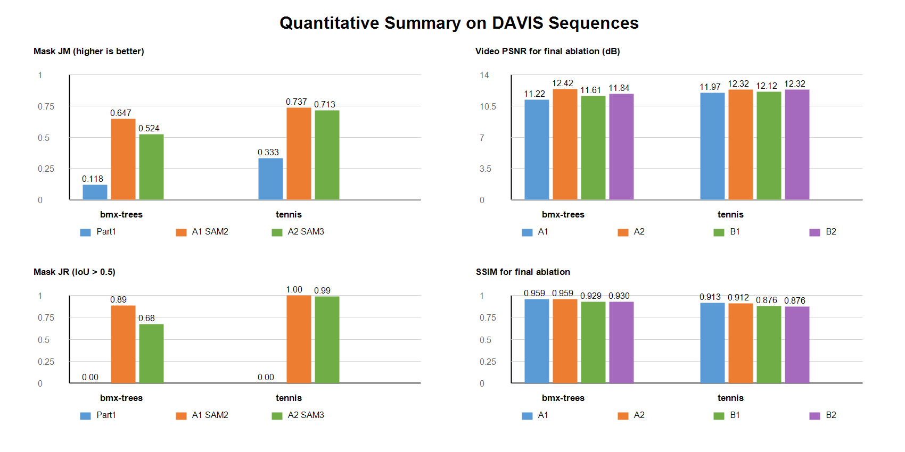
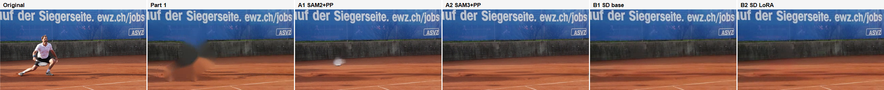
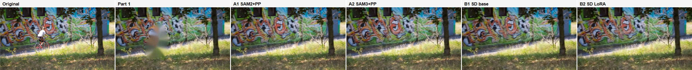
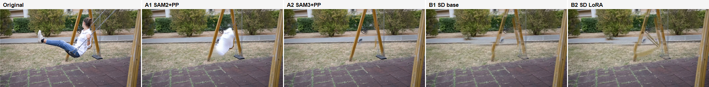

# Video Object Removal & Inpainting

**AIAA 3201 – Introduction to Computer Vision, Spring 2026, Project 3**

Automated pipeline for removing dynamic objects from videos and filling the background using three progressive approaches.

---

## Project Overview

| Part | Method | Description |
|------|--------|-------------|
| **Part 1** | Baseline (Hand-crafted) | YOLOv8 segmentation + optical flow dynamic judgment + `cv2.inpaint` |
| **Part 2** | SOTA | SAM2 video tracking + ProPainter temporal inpainting |
| **Part 3** | Optimized | SAM3 mask refinement + ProPainter + Stable Diffusion with LoRA fine-tuning |

### Key Results

| Dataset | Pipeline | JM (IoU↑) | PSNR (dB↑) | SSIM↑ |
|---------|----------|-----------|-----------|-------|
| bmx-trees | Part 2 (SAM2→PP) | 0.6474 | 11.22 | 0.9592 |
| bmx-trees | Part 3 A2 (SAM3→PP) | 0.5240 | **12.42** | 0.9588 |
| tennis | Part 2 (SAM2→PP) | 0.7369 | 11.97 | 0.9131 |
| tennis | Part 3 B2 (SAM3+PP→LoRA) | 0.7134 | **12.32** | 0.8756 |

---

## Repository Structure

```
cvproject_submission/
├── part1_baseline.py               # Part 1: hand-crafted pipeline entry point
├── part2_generate_sam2_masks.py    # Part 2: SAM2 video mask generation
├── part3_generate_sam3_masks.py    # Part 3: SAM3 per-frame mask refinement
├── part3_inpainting_pipeline.py    # Part 3: full inpainting pipeline (PP + SD + LoRA)
├── part3_finetune_sd_lora.py       # Part 3: LoRA fine-tuning on DAVIS dataset
├── eval_mask_iou.py                # Mask quality evaluation (J&F metrics)
├── evaluate_metrics.py             # Video quality evaluation (PSNR/SSIM)
├── requirements.txt
├── README.md
└── modules/
    ├── part1/baseline.py           # YOLOv8 segmentor + optical flow classifier
    ├── part2/tracker.py            # SAM2 video tracking wrapper
    ├── part2/preprocessor.py       # Mask dilation & morphological refinement
    ├── part2/inpainter.py          # ProPainter inference wrapper
    ├── part3/sam3_mask_refiner.py  # SAM3 per-frame mask refiner
    ├── part3/generative_fill.py    # Stable Diffusion inpainting wrapper
    ├── ProPainter/                 # ProPainter source (Wan et al., ICCV 2023)
    └── sam2/                       # SAM2 source (Meta Research)
```

---

## Environment Setup

**Requirements**: Python 3.10, CUDA 12.1, 2× NVIDIA GPU (≥16 GB VRAM each recommended)

```bash
# 1. Create conda environment
conda create -n cvproject python=3.10 -y
conda activate cvproject

# 2. Install PyTorch (CUDA 12.1)
pip install torch==2.5.1 torchvision==0.20.1 torchaudio==2.5.1 \
    --index-url https://download.pytorch.org/whl/cu121

# 3. Install SAM2
pip install -e modules/sam2 --no-build-isolation

# 4. Install remaining dependencies
pip install -r requirements.txt
```

---

## Model Weights

All weights must be downloaded separately (not included in this repo). Place them
under a `weights/` directory at the project root.

| Model | Used In | Size | Download |
|-------|---------|------|----------|
| `sam2.1_hiera_large.pt` | Part 2, Part 3 | ~900 MB | [Meta SAM2 releases](https://github.com/facebookresearch/sam2/releases) |
| `ProPainter.pth` | Part 2, Part 3 | ~400 MB | [ProPainter releases](https://github.com/sczhou/ProPainter/releases) |
| `raft-things.pth` | Part 2, Part 3 | ~20 MB | Same ProPainter release |
| `recurrent_flow_completion.pth` | Part 2, Part 3 | ~100 MB | Same ProPainter release |
| `stable-diffusion-inpainting` | Part 3 B1/B2 | ~4 GB | [HuggingFace](https://huggingface.co/runwayml/stable-diffusion-inpainting) |
| `sd_lora_davis/final/` | Part 3 B2 | ~10 MB | Train via `part3_finetune_sd_lora.py` |
| `yolov8n.pt` | Part 1 | ~6 MB | Auto-downloaded by `ultralytics` |

### Directory layout after downloading

```
weights/
├── part2/
│   └── sam2/
│       └── sam2.1_hiera_large.pt
├── ProPainter/
│   ├── ProPainter.pth
│   ├── raft-things.pth
│   └── recurrent_flow_completion.pth
└── sd_lora_davis/
    └── final/          ← generated by part3_finetune_sd_lora.py
        ├── adapter_config.json
        └── adapter_model.safetensors
```

### Download commands

```bash
# SAM2
mkdir -p weights/part2/sam2
wget -P weights/part2/sam2 \
  https://dl.fbaipublicfiles.com/segment_anything_2/092824/sam2.1_hiera_large.pt

# ProPainter
mkdir -p weights/ProPainter
wget -P weights/ProPainter \
  https://github.com/sczhou/ProPainter/releases/download/v0.1.0/ProPainter.pth \
  https://github.com/sczhou/ProPainter/releases/download/v0.1.0/raft-things.pth \
  https://github.com/sczhou/ProPainter/releases/download/v0.1.0/recurrent_flow_completion.pth

# Stable Diffusion (requires huggingface-hub)
huggingface-cli download runwayml/stable-diffusion-inpainting \
  --local-dir ~/.cache/huggingface/hub/models--runwayml--stable-diffusion-inpainting

# YOLOv8 (auto-downloaded on first run, or manually)
wget -O yolov8n.pt https://github.com/ultralytics/assets/releases/download/v0.0.0/yolov8n.pt
```

---

## Usage

### Part 1 – Baseline (Hand-crafted)

```bash
python part1_baseline.py \
    --video data/raw/tennis.mp4 \
    --points "[[350,400]]" \
    --labels "[1]"
```

### Part 2 – SAM2 + ProPainter

```bash
# Step 1: Generate SAM2 masks
PYTHONPATH=modules/sam2 python part2_generate_sam2_masks.py \
    --datasets tennis bmx-trees wild_video

# Step 2: Run ProPainter inpainting
python part3_inpainting_pipeline.py \
    --datasets tennis bmx-trees wild_video \
    --pipelines sam2_propainter \
    --gpu_pp cuda:0
```

### Part 3 – SAM3 + ProPainter + SD + LoRA

```bash
# Step 1: Generate SAM2 coarse masks (same as Part 2 Step 1)

# Step 2: Refine masks with SAM3
PYTHONPATH=modules/sam2 python part3_generate_sam3_masks.py \
    --datasets tennis bmx-trees wild_video

# Step 3 (optional): Fine-tune SD with LoRA
python part3_finetune_sd_lora.py \
    --data_dir data/raw \
    --output_dir weights/sd_lora_davis

# Step 4: Run all four pipelines
python part3_inpainting_pipeline.py \
    --datasets tennis bmx-trees wild_video \
    --pipelines sam2_propainter sam3_propainter sam3_pp_sd_base sam3_pp_sd_lora \
    --gpu_pp cuda:0 \
    --gpu_sd cuda:1
```

Pipelines:
- **A1** `sam2_propainter` – SAM2 masks → ProPainter
- **A2** `sam3_propainter` – SAM3 refined masks → ProPainter
- **B1** `sam3_pp_sd_base` – SAM3 + ProPainter → SD base inpainting
- **B2** `sam3_pp_sd_lora` – SAM3 + ProPainter → SD with DAVIS LoRA

Output: `data/outputs/part3_new/{pipeline}/{dataset}/inpaint_out.mp4`

### Evaluation

```bash
# Mask quality (J & F metrics)
python eval_mask_iou.py --pred_dir data/mask/unified/sam2 --gt_dir data/Annotations

# Video quality (PSNR / SSIM)
python evaluate_metrics.py --output_root data/outputs/part3_new --gt_root data/raw
```

---

## Visual Results

### Quantitative Summary



*JM (IoU), JR (recall), PSNR and SSIM for all pipelines across three datasets.*

---

### Frame-by-Frame Inpainting Comparison

Each figure shows (left to right): **Original frame** | **SAM2 mask** | **Part 2 (SAM2+PP)** | **Part 3 best (SAM3+PP+LoRA)**

**Tennis:**



**BMX-Trees:**



**Wild Video:**



---

## Notes

- **PYTHONPATH**: SAM2 requires `modules/sam2` on the Python path.
- **Proxy / Offline**: Set `HF_HUB_OFFLINE=1` and `TRANSFORMERS_OFFLINE=1` if HuggingFace is blocked after downloading weights.
- **Tennis shadow fix**: `part2_generate_sam2_masks.py` includes a geometric post-processing step (`tennis_shadow_fill`) that extends the mask to cover the player's shadow, raising tennis IoU from 0.584 → 0.737.
- **SAM2 non-determinism**: SAM2 mask generation is non-deterministic due to CUDA random ops. Use saved masks from `data/mask/unified/sam2/tennis_v5_backup/` for reproducibility.
